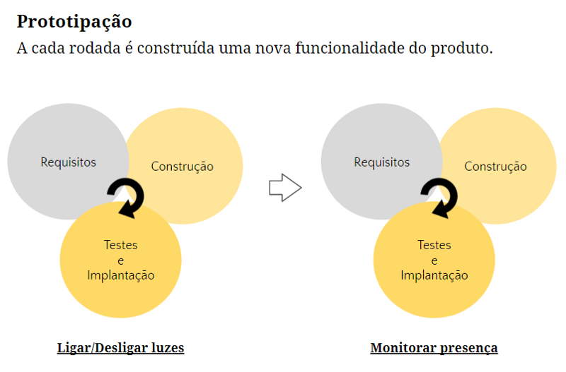

### Vantagens desta metodologia:
- Visualização clara do progresso.
- Útil quando os requisitos mudam rapidamente.

### Principal desvantagem desta metodologia:
- Dificuldade para determinar o tempo exato em que uma funcionalidade vai ser construída.
